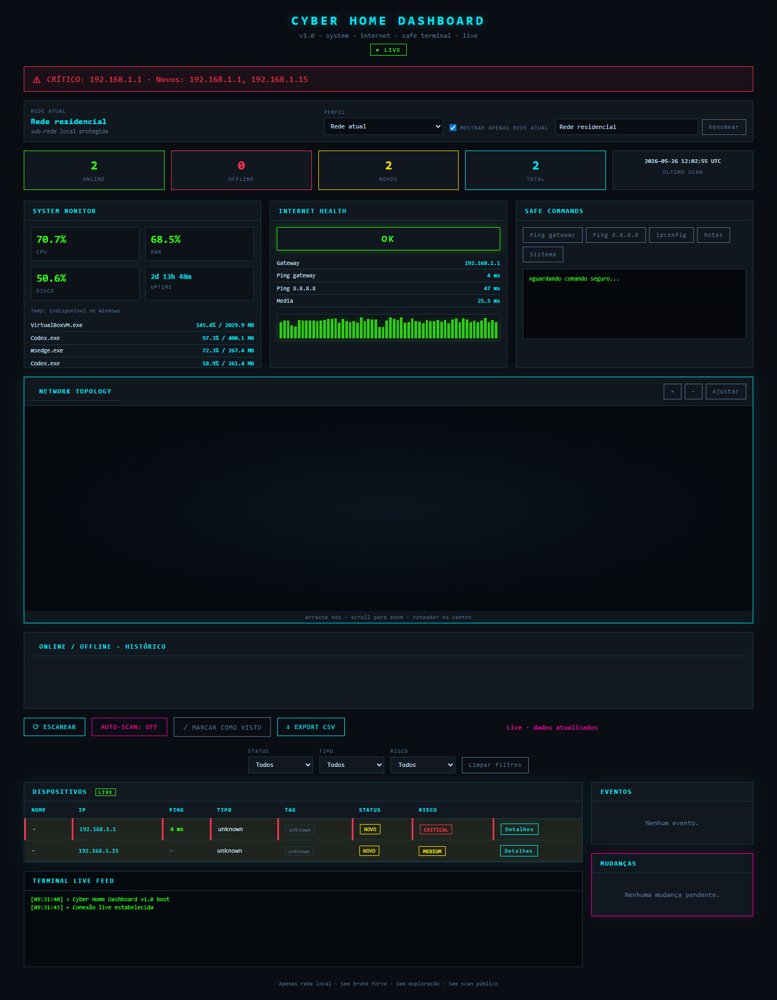
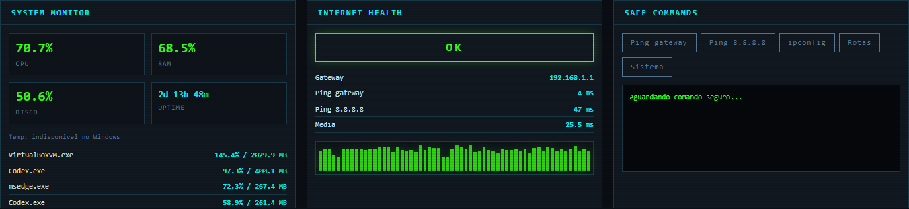
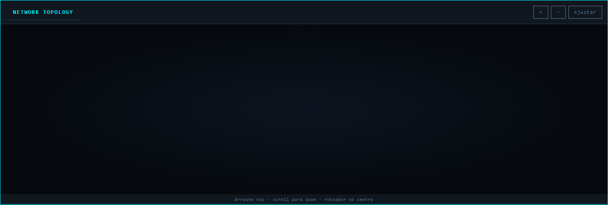
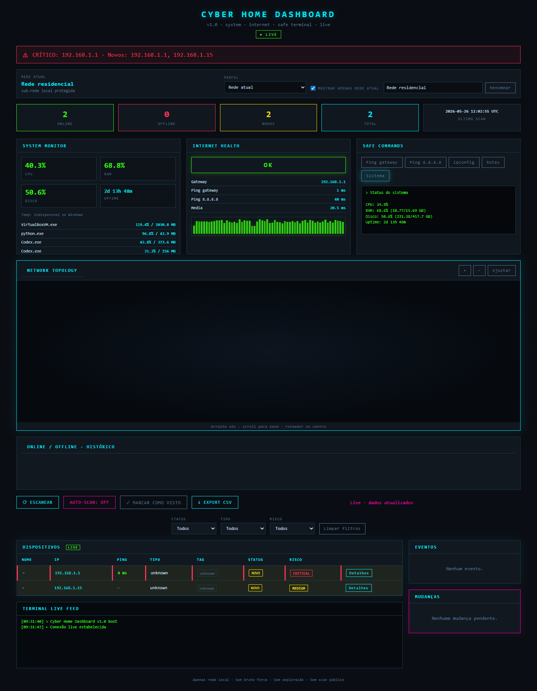

<div align="center">

# Cyber Home Dashboard

**Local network monitoring dashboard built with FastAPI, SQLite, WebSocket and a cyberpunk UI.**


Central local e defensiva para monitorar dispositivos autorizados, saúde do notebook e conectividade da internet.

</div>

---

## Preview



| System Monitor | Network Topology | Safe Terminal |
| --- | --- | --- |
|  |  |  |

As imagens de portfólio usam identificadores e endereços de rede mascarados.

**[Assistir demonstração curta](docs/demo/dashboard-demo.webm)**

## Features

- Inventário local de dispositivos limitado à sub-rede autorizada.
- Perfis de rede separados por gateway, sub-rede e SSID para preservar históricos por ambiente.
- Eventos de dispositivos novos, offline e retornando online.
- Baseline de mudanças em hostname, vendor, MAC, IP e portas observadas.
- Topologia visual da rede com posições persistidas em SQLite.
- Atualizações em tempo real por WebSocket.
- Monitor local de CPU, RAM, disco, uptime, processos pesados e temperatura, quando disponível.
- Saúde da internet com gateway, ping controlado para `8.8.8.8` e histórico recente de latência.
- Safe Terminal com ações fixas e allowlistadas, sem comando livre.
- Exportação de inventário e detalhes em CSV/JSON.

## Stack

| Camada | Tecnologia |
| --- | --- |
| Backend | Python, FastAPI, Uvicorn |
| Dados | SQLite |
| Tempo real | WebSocket |
| Métricas locais | psutil |
| Frontend | HTML, CSS, JavaScript vanilla |
| Visualização | Chart.js, vis-network |
| Descoberta opcional | Nmap |

## Como rodar no Windows

```powershell
cd C:\caminho\cyber-home-dashboard
py -3 -m venv .venv
.\.venv\Scripts\python.exe -m pip install --upgrade pip
.\.venv\Scripts\python.exe -m pip install -r requirements.txt
Copy-Item .env.example .env
```

Descubra sua sub-rede local autorizada:

```powershell
py -3 .\detect_local_network.py
```

Configure `.env` usando somente a sua rede:

```env
SCAN_INTERVAL_SECONDS=60
ALLOWED_NETWORK=192.168.1.0/24
USE_NMAP=false
FALLBACK_SWEEP=false
```

Inicie o dashboard:

```powershell
.\.venv\Scripts\python.exe -m uvicorn main:app --host 127.0.0.1 --port 8000 --app-dir backend
```

Abra [http://127.0.0.1:8000](http://127.0.0.1:8000).

## Estrutura

```text
backend/                 API FastAPI, scanner, banco, monitoramento e WebSocket
frontend/                Interface web e visualização de topologia
docs/                    Arquitetura, imagens, demo e notas complementares
scripts/                 Captura controlada de mídia para demonstração
.env.example             Configuração segura de exemplo
PROJECT_SUMMARY.md       Visão técnica do projeto
ROADMAP.md               Evolução planejada
SECURITY.md              Limites de uso e política de segurança
```

## API principal

| Endpoint | Uso |
| --- | --- |
| `GET /health` | Estado básico do backend |
| `GET /api/system/status` | Métricas do notebook |
| `GET /api/network/health` | Saúde da conexão e histórico |
| `GET /api/networks` | Perfis de rede identificados |
| `GET /api/devices` | Inventário filtrado por rede |
| `GET /api/topology` | Nós e relações visuais |
| `POST /api/tools/run` | Comandos seguros allowlistados |
| `WS /ws/events` | Atualizações em tempo real |

## Segurança e uso ético

Este projeto foi construído para aprendizado e monitoramento defensivo em redes próprias ou explicitamente autorizadas.

- Não realiza brute force.
- Não explora vulnerabilidades.
- Não escaneia IPs públicos.
- Não expõe dispositivos à internet.
- Não aceita execução livre de comandos no terminal web.
- Não versiona `.env`, banco local, logs ou capturas de tráfego.

Leia [SECURITY.md](SECURITY.md) antes de adaptar o scanner ou disponibilizar a aplicação na rede local.

## Aprendizados

Este projeto reúne estudos práticos sobre:

- separação de histórico por contexto de rede;
- APIs e atualizações em tempo real;
- observabilidade local com métricas úteis;
- desenho de ferramentas defensivas com escopo limitado;
- cuidado com privacidade ao publicar screenshots e demonstrações.

## Roadmap

- Persistência de histórico de conectividade.
- Autenticação local para acesso ao dashboard.
- Docker e execução em mini PC ou Raspberry Pi.
- Notificações locais para eventos relevantes.
- Uso responsável de IA para resumir eventos e sugerir verificações defensivas.

Veja o planejamento completo em [ROADMAP.md](ROADMAP.md).

## Documentação

- [Resumo técnico](PROJECT_SUMMARY.md)
- [Arquitetura](docs/architecture.md)
- [Política de segurança](SECURITY.md)
- [Roadmap](ROADMAP.md)
- [Changelog](CHANGELOG.md)

## Licença

Distribuído sob licença MIT. Veja [LICENSE](LICENSE).
